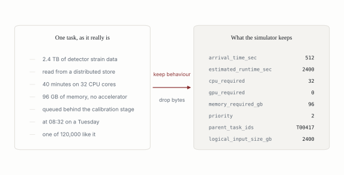
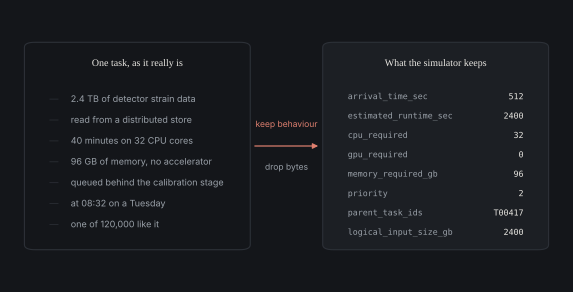
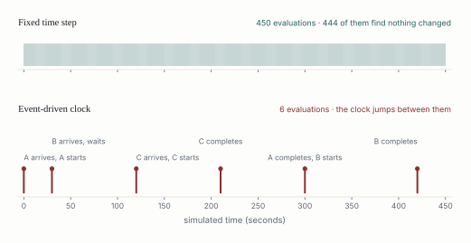
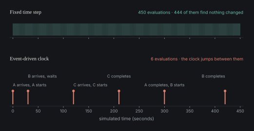
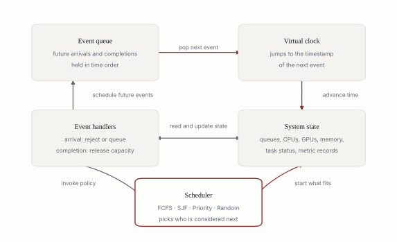
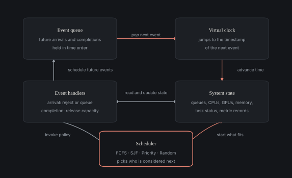
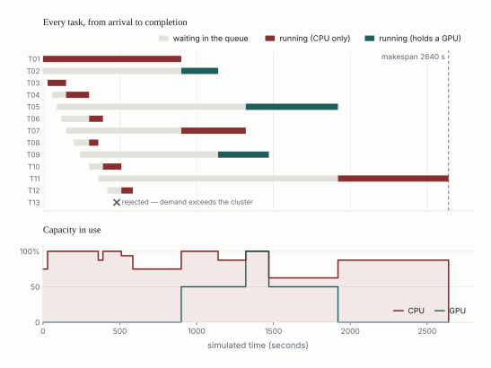
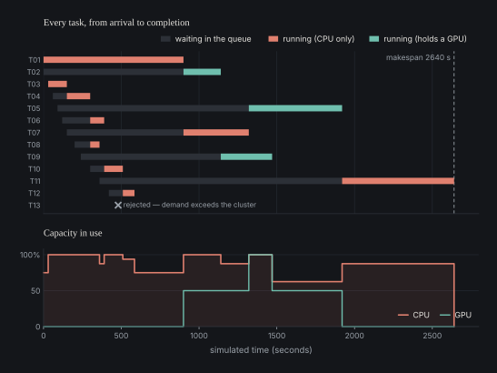
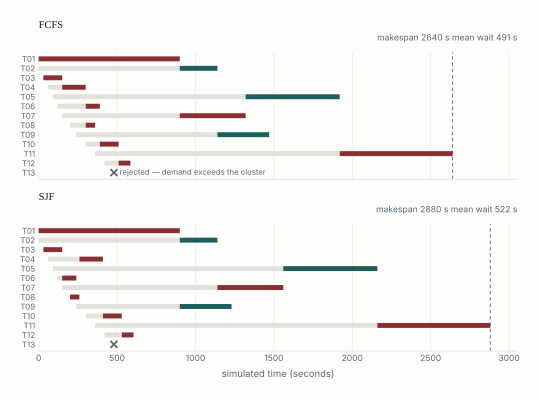
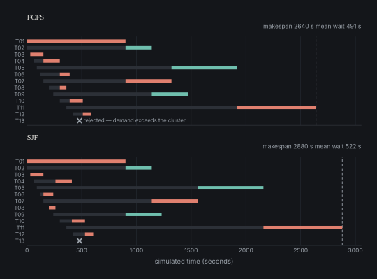

The Einstein Telescope is expected to produce data workflows at the petabyte scale,
with heterogeneous compute demands and scheduling problems that nobody has solved yet.
Someone has to design the methods that will manage those workflows. The awkward part is
that designing them appears to require the thing being designed for: continuous access
to petabyte datasets and to the expensive machines that process them. Students and
research teams do not have that access, so the methods tend to get built late, by
whoever is already inside the facility, and tested once rather than compared.

This project is my attempt at the cheap layer that should come first. It represents a
workflow as lightweight task metadata, simulates that metadata under constrained
resources, and lets scheduling and capacity decisions be tested and compared on an
ordinary laptop. It is not a replacement for experiments on real infrastructure. It is
the thing you use before them, so that you arrive at the real machine with a short list
instead of a blank page.

## Simulating the description instead of the data

The move the whole project rests on is separating the logical scale of a workflow from
its physical scale. A workflow might represent terabytes or petabytes of science, but
if the question is when tasks run, what they wait for, and where queues form, then the
contents of those bytes never enter the calculation. What matters is how long a task
occupies which resources, and when it shows up. So the simulator keeps that and throws
away everything else.

::::: {#f-1}
::: {.light-content}
{fig-alt="A real task described in six lines beside the eight metadata fields the simulator stores"}
:::
::: {.dark-content}
{fig-alt="A real task described in six lines beside the eight metadata fields the simulator stores"}
:::
:::::

::: {.figure-caption}
Figure 1. What survives the abstraction. The left column is a task as it exists; the
right column is everything the simulator needs in order to reason about when it runs.
:::

The practical consequence is a change of several orders of magnitude. A workload of
120,000 tasks representing a few petabytes of logical data is roughly 40 MB of CSV. It
loads into memory on any laptop, and a simulated run of it finishes in seconds.

The limitation is in the same sentence as the benefit. This abstraction is only valid
for questions where the content of the data does not matter. Ask about data movement,
cache behaviour or network topology, and the thing you dropped is exactly the thing you
needed. I come back to that below, because it is the honest boundary of the approach
rather than a to-do item.

## Why the clock jumps

The engine is a discrete-event simulator, and this is the part I would most want to
defend, because it is what makes the rest affordable.

A time-stepped simulation advances a fixed interval at a time and recomputes the state
of the system at each step. Most of that work is wasted. Between one task finishing and
the next arriving, nothing about the system changes, so there is nothing to recompute.
An event-driven engine instead keeps a queue of the moments when the state *will*
change and jumps the clock straight to the next one.

::::: {#f-2}
::: {.light-content}
{fig-alt="A dense comb of 450 one-second time steps above a sparse timeline with six labelled events"}
:::
::: {.dark-content}
{fig-alt="A dense comb of 450 one-second time steps above a sparse timeline with six labelled events"}
:::
:::::

::: {.figure-caption}
Figure 2. The same three-task scenario under both schemes. Stepping one second at a
time takes 450 evaluations, 444 of which find nothing has changed. The event-driven
clock touches six moments, which are the only six at which anything happens.
:::

The important property is what the cost scales with. A time-stepped run costs more if
you simulate a longer horizon or choose a finer resolution, even when the workload is
identical. An event-driven run costs what the workload costs: one arrival event per
task, one completion event per task that runs. A month-long workload of 50,000 tasks is
about 100,000 events, whichever way you slice the calendar.

That is not just an efficiency note. It is what makes the experimental design possible.
If a single run is cheap, you can afford to run the same workload under four scheduling
policies, at a dozen seeds, across a sweep of cluster configurations, and talk about
distributions of outcomes rather than one anecdote. An expensive simulator gets used
once and quoted; a cheap one gets used properly.

## How the engine is put together

Five components carry the entire simulation.

::::: {#f-3}
::: {.light-content}
{fig-alt="Event queue, virtual clock, event handlers, system state and scheduler, connected in a loop"}
:::
::: {.dark-content}
{fig-alt="Event queue, virtual clock, event handlers, system state and scheduler, connected in a loop"}
:::
:::::

::: {.figure-caption}
Figure 3. One turn of the loop. The queue holds the future, the clock jumps to it, a
handler changes the state, and the scheduler decides who gets the capacity that just
became available.
:::

The **event queue** is the timeline. At the start it holds one arrival event per task,
in time order; every time a task starts running, a completion event is pushed onto it
at the appropriate future time. The **virtual clock** does no work of its own — it
simply takes the timestamp of whatever event comes off the queue next. The **system
state** is the simulated cluster: total and available CPUs, GPUs and memory, plus the
waiting, running, completed and rejected tasks, updated after every event.

The **handlers** contain the logic. When a task arrives, the first question is not
whether it can run now but whether it could *ever* run: if it asks for more CPUs, GPUs
or memory than the whole cluster has, it is marked rejected rather than left in a queue
forever. That case is reported in the output rather than hidden, because in practice it
usually means the workload assumptions and the cluster configuration disagree, and it
is better to be told that than to watch a queue never drain. Otherwise the task joins
the waiting queue and the scheduler is invoked. When a task completes, its resources go
back to the pool, its timings are recorded, and the scheduler is invoked again, because
capacity has just appeared.

The **scheduler** is the part that is meant to be swapped. It orders the waiting queue
according to a policy — first-come first-served, shortest job first, priority, random —
and the engine then starts every task that fits, in that order. It is worth being
explicit about one design decision here: a task the policy ranks first but that does not
currently fit does not block the queue. The engine keeps looking, so a two-core job is
not stuck behind a fourteen-core one waiting for a hole. That is a deliberate modelling
choice resembling backfilling on a real batch system, and it materially changes the
results, so it belongs in the description of the model rather than buried in the code.

## What one run looks like

Here is an actual run: thirteen tasks against a cluster of 16 CPUs, 2 GPUs and 256 GB,
under first-come first-served. The whole simulation is thirty-seven events.

::::: {#f-4}
::: {.light-content}
{fig-alt="Gantt chart of thirteen tasks showing waiting and running periods, above a step plot of CPU and GPU capacity in use"}
:::
::: {.dark-content}
{fig-alt="Gantt chart of thirteen tasks showing waiting and running periods, above a step plot of CPU and GPU capacity in use"}
:::
:::::

::: {.figure-caption}
Figure 4. One simulated run. Each task waits (grey) and then runs (colour); the lower
panel is the fraction of CPU and GPU capacity held at each moment. Nothing here was
drawn by hand — it is the engine's output for this workload.
:::

The figure shows the kind of thing that is hard to reason about on paper. T01 takes
twelve of the sixteen cores for the first 900 seconds, so for that whole period the
cluster behaves as though it were a four-core machine, and only small tasks fit in the
gap. T11 needs fourteen cores; it arrives at 360 seconds and does not start until 1920,
having waited 1560 seconds for a hole large enough to hold it, while eight smaller tasks
that arrived after it have come and gone. T13 asks for 24 cores on a 16-core cluster and
is rejected at arrival. The GPU trace shows a resource that is either half idle or fully
saturated and never anything in between, because only three tasks in this workload want
one.

Each run produces a task-level table with the full lifecycle of every task, a queue
timeline, a resource-utilization timeline, and the aggregate metrics you would expect:
makespan, completion rate, mean and median wait, turnaround, throughput, mean
utilization per resource, and total core-seconds. The queue timeline is where backlog
formation shows up; the utilization timeline is where you find out whether you are
CPU-bound, GPU-bound, memory-bound, or simply scheduling badly.

## The comparison is the point

A single run is a description. The reason to build the thing is comparison, and
comparison is only meaningful if it is controlled: hold the workload fixed, hold the
cluster fixed, hold the seeds and runtime assumptions fixed, change one policy, and
attribute the difference to that policy under those stated conditions.

::::: {#f-5}
::: {.light-content}
{fig-alt="The same thirteen tasks scheduled by first-come first-served and by shortest job first, with different makespans and mean waits"}
:::
::: {.dark-content}
{fig-alt="The same thirteen tasks scheduled by first-come first-served and by shortest job first, with different makespans and mean waits"}
:::
:::::

::: {.figure-caption}
Figure 5. Identical workload, identical cluster, identical seed; only the scheduling
policy differs. Shortest job first, the textbook choice for minimising waiting time,
does worse here on both measures.
:::

That result is the reason I find this worth doing. Shortest job first is supposed to
minimise mean waiting time, and in the classical setting — one resource, all jobs
present at the start — it does. Here it loses on both counts: mean wait rises from 491
to 522 seconds and makespan from 2640 to 2880. The mechanism is visible in the figure.
Because the engine already lets small tasks slip into gaps, first-come first-served is
not actually starving them; meanwhile shortest job first keeps deferring the two widest
tasks, T05 and T11, until almost everything else has drained, and the run acquires a
long thin tail where the cluster is mostly idle. Priority scheduling and random
selection both land near 658 seconds of mean wait, worse than either.

I am not claiming first-come first-served is the better policy. The claim is narrower
and more useful: with multiple resource dimensions, staggered arrivals and backfilling,
the textbook ranking does not survive, and which policy wins depends on the shape of the
workload rather than on the policy alone. That is precisely the kind of question you
cannot settle by argument, and precisely why a cheap testbed earns its place.

## The workload description turned out to be the hard part

The engine itself is a few hundred lines. Most of the code in the repository is not the
simulator — it is the machinery for describing the workload, and that surprised me at
first. The reason is that a simulation result is worth exactly as much as the workload
description behind it, and a workload description is a scientific claim. If I tell you
that a policy reduces mean wait by 12%, your next question should be where my runtime
estimates came from, and whether you can reproduce the workload I ran them on. Without
an answer, the number is decoration.

So the metadata layer is built to answer that. The canonical schema is 81 fields, and
its most important property is that it refuses to mix different kinds of statement:
what a task *requested*, what it was *allocated*, what was *observed*, its *peak* use,
what was *estimated* from assumed rates, and what was actually *billed* are separate
fields that stay null when unknown. A measurement never quietly becomes an assumption.
Validation runs structural, temporal, semantic, provenance, referential and dependency
checks, produces a weighted quality score, and can block a release outright — a
scenario with an unassigned owner or missing provenance is not fit to base a decision
on, however clean its numbers look.

Reproducibility is enforced rather than hoped for: the same configuration and seed
produce byte-identical output, and a release is exported as a bundle carrying the
configuration, validation report, per-artifact checksums, the runtime environment and a
contract stating exactly what a third party needs in order to regenerate it. Real
traces can be imported instead of generated — there are adapters for Slurm accounting
records, Kubernetes, Airflow, Spark, Prometheus and others — with every canonical field
traceable back to a source column, a documented default or an explicit rule, and
automatic mappings always requiring review before they commit. Given a real trace, the
system can also fit a synthetic twin and score how closely it matches on distributions,
correlations, arrivals and tail coverage. That score is reported alongside a warning I
think is important: fidelity is not validity. A twin can match a trace closely and still
represent the wrong population.

## What it cannot do

The engine does not model data movement, network contention, storage latency or
distributed file systems. It does not talk to SLURM, Kubernetes or MPI. It does not
model node failures or real detector pipelines. These are deliberate exclusions at this
stage rather than an unwritten roadmap: they are what keeps the model small enough to
explain and cheap enough to run.

Two limits matter more than that list. The first is that runtime is an input, not a
prediction. Every result is conditional on runtime estimates being roughly right, and if
they are systematically wrong the simulator will produce confident, internally
consistent, wrong answers, with nothing in its output to indicate the problem. The
second is that no simulator validates itself. Until this has been fitted to real
scheduler logs and backtested against what those systems actually did, it is an
instrument for generating hypotheses about scheduling, not evidence about any particular
facility.

## What I would want to do next

Four questions follow directly from the current state, and they are the ones I would
want to work on.

The first is uncertainty. Every result above treats runtime as a point estimate, when
real runtimes are distributions with heavy tails. Propagating that properly means asking
whether the ranking between policies is stable under runtime uncertainty or whether it
flips, and the answer determines how much any comparison of this kind is worth.

The second is learned policies. The natural use of a cheap simulator is to train a
scheduling policy in it, which immediately raises the sim-to-real question: does a
policy trained on metadata transfer to a real batch system, and can the size of the
transfer gap be predicted from the fidelity score of the workload it was trained on?
That is the question I find most interesting, because it makes the fidelity machinery do
real work rather than sit in a report.

The third is validation, which is the precondition for the other two: fit real HPC
scheduler logs, backtest the simulator against recorded outcomes, and publish the gap
honestly.

The fourth is the boundary of the abstraction itself. Adding data movement and network
constraints and then measuring how much the conclusions move would answer whether
metadata-only simulation is sufficient, and for which class of question. If the answers
barely change, the abstraction is justified; if they change a lot, that is a more
interesting result and worth knowing early.

## Where it came from

The project began as a research proposal for ETCETERA, the programme preparing the
Einstein Telescope for the era of gravitational-wave astronomy, titled *Simulating
Petabyte-Scale Scientific Workflows Without Petabyte Data*. Gravitational-wave
computing is the motivating case, but nothing in the kernel is specific to it: tasks,
events, resources, policies and evidence are domain-neutral, and the domain vocabulary
lives in labels, adapters and extension fields. The same machinery applies to data
centres, industrial workflows and other scientific facilities.

## Status

::: {.callout-note appearance="simple"}
**Active research build.** The metadata, validation, calibration and governance layers
are usable end to end; the event-driven engine currently runs as a separate prototype
and is being folded into the same pipeline. Interfaces will still change.
:::

- [Source](https://github.com/Ma-Mar-Itan/Systems-Decision-Lab)
- Run it locally: `pip install -r requirements.txt`, then `python -m streamlit run app.py`
- The engine used for Figures 2, 4 and 5 on this page is `_engine.py` in this folder;
  `_figures.py` rebuilds every figure from its output.
