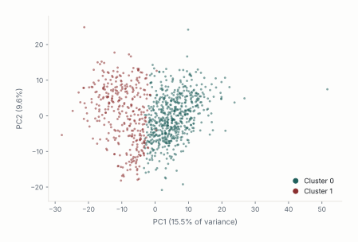
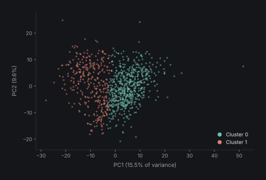
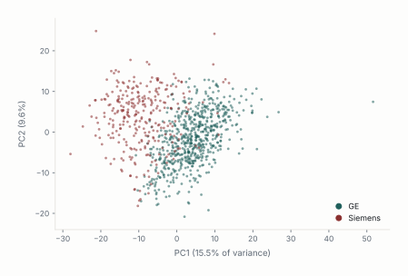
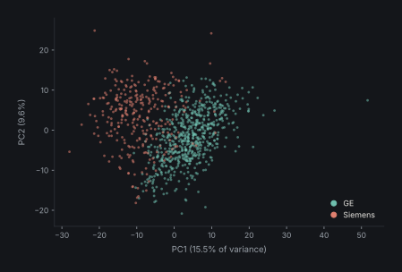

```{python}
#| label: setup
import sys, pathlib
sys.path.insert(0, str(pathlib.Path().resolve()))
import pandas as pd
from IPython.display import Markdown
from _theme import DATA, DIR, show
if not (DIR / "figures" / "fig-scree-light.svg").exists():
    import matplotlib; matplotlib.use("Agg")
    import _figures; _figures.build_all()
```

::: {.title-page}
BEIRUT ARAB UNIVERSITY  
Faculty of Science  
Department of Mathematics  
Project · Medical Statistics  
Trapped by Stability:  
A Falsification Framework for Acquisition-Driven Radiomic Phenotypes  
PREPARED BY   Malek M. Itani  
SUPERVISED BY   Dr. Lama Affara  
ACADEMIC YEAR   2025 – 2026  
:::


# Abstract

In this work, we do not offer an additional radiomic phenotype from breast MRI, but rather we expose a type of failure mode of phenotype claims that may succeed at standard internal validation: the stability trap. Specifically, one can generate a partition that is reproducible to resampling, shows what could otherwise be mistaken for prognostic signal but have no underlying biology in common. We generated via a common unsupervised pipeline the kind of result that could easily be overinterpreted from a large 922 patient multi-vendor breast MRI dataset. This included creating a reproducible two-cluster partition with enhancement- like, vascularity feature differences as well as a recurrence-free survival relationships in HR+/HER2+ disease. We submit this negative result as a case of falsification, not as a biomarker option. Scanner identity and pulse-sequence basis were each strongly associated with the unsupervised partition. In contrast, subtype and whole-cohort recurrence were weakly associated with clusters. Harmonization through manufacturer residualization or ComBat eliminated the HR+/HER2+ survival relationship and maintained internal clusterability at the expense of the initial patient partitioning. While the harmonization informed or residualized postprocessing association structure was statistically cleaner, it did not pass biological plausibility checks and was more strongly correlated with tumour size than recurrence or subtype. Our primary contribution is therefore a framework: we offer a falsification benchmark to test radiomic phenotype claims. Discovery across multiple conditions, sensitivity to harmonization, and within vendor sanity checks are among the minimum recommended checks we propose for multi-vendor MRI, multicenter radiomics work and AI image studies where technical noise can overfit as if it were biology.

Keywords

Breast MRI; radiomics; phenotype discovery; ComBat harmonization; acquisition confounding; cluster stability; cluster identity; imaging AI reproducibility.


# Introduction

One of the promises of the field of radiomics, is the ability to identify latent imaging subgroups representing phenotypes undetectable to standard labelling methods. Imaging methods such as breast MRI and dynamic contrast-enhanced imaging allows for the generation of quantitative features describing hidden heterogeneity in tumour morphology, vascularity and cellularity that can be utilized in unsupervised machine learning techniques. In theory this practice would allow physicians to capture stable cluster associated structures with meaningful biological variations that go beyond standard procedures of relying on receptor base labelling [@lambin2012].

In practice, multivendor sourced data sets have showcased that acquisition associated variables can influence inference through features such as manufacturer, pulse-sequence parameters, field strength, voxel geometry, reconstruction choices, and acquisition timing [@zwanenburg2020]. When dealing with high dimensionality, even minute acquisition effects can dominate the feature space after dimensionality reduction, resulting in clustering algorithms that recover partitioning based on technology rather than biology.

Validation techniques rely heavily on metrics that assess reproducibility of the results rather than validity, failing to distinguish between a biologically meaningful phenotype and a technically induced one [@handl2005]. This overreliance on stability creates what we term “The Stability Trap”: the mathematical illusion that a data partition is biologically valid simply because its underlying technical artifact is highly stable and reproducible.

This distinction between stability and validity is what motivates the present study, rather than treating cluster discovery and stability as the endpoint of phenotype identification, this study proposes a falsification chain that presents any potential phenotype discovery a set of acquisition aware challenges designed to expose technical confounding.

The first step is evaluating the raw radiomic feature space, testing whether dominant principal components are associated with biological and/or technical acquisition variables. The second step is stress testing cluster identity; any real biological phenotype would withstand technical corrections through manufacturer residualization and ComBat harmonization. Hence phenotype discovery is repeated after taking into account manufacture effects. Similar to the second step, the final step is revaluating clinical interpretation after adjustment for manufacturer and across harmonization strategies.

Using our proposed falsification framework, we examine a cohort of 922 breast MRI patients. We first provide evidence of a stable two-cluster radiomic phenotype with enhancement-dominant, vascularity-like characteristics and an apparent HR+/HER2+ recurrence-free survival signal. Then we showcase that the dominant variance axes are led by acquisition parameters rather than biological factors. The contribution of this study is therefore methodological rather than biomarker-driven: it shows that a phenotype can be internally stable, visually interpretable, and apparently prognostic while still failing tests of biological identity.


# 2. Background and Rationale


## Radiomic phenotype discovery

Radiomics allows for the extraction of quantitative information from routine medical images, and thus promises to expand the knowledge on tumour phenotype that is not captured by visual interpretation. This allows radiomics to be positioned as the main bridge between medical imaging and personalized medicine, allowing it to complement histology, genomics, and clinical covariates in risk stratification and treatment selection [@lambin2012]. One particularly relevant image modality is Breast MRI as dynamic contrast-enhanced MRI, diffusion-weighted imaging, T2-weighted imaging, and enhancement kinetics enables the acquisition of information related to vascularity, cellularity, morphology, and tissue heterogeneity [@pinker2018].

While the majority of previous work has focused on supervised learning, radiomics shows great potential in the unsupervised learning subfield, where patients are clustered solely based on feature space. These clusters are then studied for associations with prognosis, molecular subtype, immune state, stromal composition, or pathway activity [@li2018]. This allows for the discovery of image derived subtypes of cancer through survival analysis, molecular pathways, and treatment response [@yamamoto2012; @aerts2014]. Collectively, there is consensus on the great potential of radiomics to provide clinically meaningful insight on the biological variations of tumours [@gillies2016].


## Supervised versus unsupervised settings

What separates radiomic studies using supervised and unsupervised clustering techniques is the failure mode that supervised learning has managed to avoid albeit partially. In supervised techniques, outcomes labels are provided and exist outside of feature space, which allows the judgment of model performance to be against a predefined endpoint (molecular subtype, recurrence, or treatment response), limiting the effects of technical confounding on model inference [@parmar2015]. This has allowed supervised radiomics to advance much more rapidly towards clinical use, whereas unsupervised radiomics remains lagging [@park2020]. This external validation does not exist in unsupervised techniques, where clustering models are created based solely on the feature space that may contain scanner, protocol, or manufacturer effects. If technological differences in radiomic feature space is better positioned to explain the variance in structure, the clustering algorithms will recover these hardware-defined partitions before they encounter tumour-defined ones. And standard validation metrics such as silhouette score and bootstrap stability end up testing the reproducibility of these partitions rather their biological validity [@handl2005], resulting in the “stability trap”:

Mathematical reproducibility can be mistaken for biological validity.


## Technical variance in radiomics

The literature describing the impact of acquisition effects on radiomic features is extensive, where many features such as voxel size and gray-level discretization become nonreproducible due to acquisition variation [@berenguer2018; @mackin2015; @duron2019; @leijenaar2015]. This lack of reproducibility has resulted in inability of radiomics to completely transition from theoretical work to the mainstream clinical workflow, although the great effort at standardizing the field such as the Image Biomarker Standardisation Initiative [@zwanenburg2020; @traverso2018].

Adding greater challenge is the unstandardized nature of MRI imaging [@nyul1999], where protocols, coils and pulse sequences tend to differ across different vendors.

Perhaps the most direct proof-of-concept comes from multi-vendor breast MRI radiomics studies, which have shown that non-biological features can accurately predict the scanner platform and field strength with area-under-the-curve values ranging from 0.91 to 1.00 [@doran2021]. That same study found the pipeline’s ability to predict tumour biology was only modest (AUC = 0.673 for pathological nodal status) when using radiomic features without any clinical variables. That key result illustrates that radiomic features can encode strong technical signals, and that technical structure can directly compete with tumour biology in the same feature space.


## Harmonization and its limits

Feature-level harmonization is the current solution to unwanted scanner or site effects. Developed initially for batch-effects in gene-expression data, ComBat was later extended to neuroimaging and radiomics with the goal of removing scanner, site, and protocol effects while retaining biological information [@johnson2007; @fortin2018]. In radiomics, ComBat and variants have been used almost exclusively to improve cross-site comparability of radiomic features or the transportability of supervised models built on those features [@leithner2022]. Harmonization has been shown to reduce batch effects and improve performance in PET radiomics studies, MRI radiomics studies, and multi-centre datasets [@daano2020].

However, existing evaluations of ComBat harmonization assume that the biomedical endpoint matters. That is fine for supervised prediction, but it does not match the logic of unsupervised phenotypes. For phenotype discovery, the key question is what happens to the patient partition after harmonization. If the cluster reflects manufacturer-related variance more than tumour biology, then ComBat may leave the mathematical stability intact while substituting a different partition that also passes validation checks. Standard validation metrics would not alert the investigator because the mathematical properties of the cluster haven’t changed, even though the biological meaning of the phenotype might have [@lozano2024].


## The validation gap

It is widely accepted that for prediction modelling, performance and internal validity is not enough but rather claims should be required to go through robustness checks, stress tests and external validation for generalizability to be accepted [@collins2015]. In this context, any claim of phenotype discovery should be exposed to tests that aim to disprove biological interpretations. As such this study aims to define an acquisition-aware falsification chain for unsupervised radiomic phenotypes where the main question is not whether a reproducible cluster exists, but whether the same biological claim can survive when technical sources of variance are explicitly tested. This will require practitioners to ask whether clusters map more strongly to manufacturer than molecular subtypes? Whether the main principal components are dominated by acquisition variables? Whether cluster identity or prognostic relevance survive residualization and ComBat? Whether the stress tested clusters still meet minimum biomarker criteria [@lu2021].

The contribution of the present paper is therefore methodological rather than biomarker-driven. It does not argue that unsupervised radiomic discovery is invalid in general. Instead, it argues that cluster stability is not equivalent to biological validity, especially in multi-vendor datasets. A phenotype may be internally stable, visually interpretable, and apparently prognostic while still being dominated by technical variance. While the literature has already established that feature space can be dominated by acquisition techniques, and that this can be mitigated through harmonization literature [@yamamoto2012; @traverso2018; @daano2020], what is still missing is a standardized end to end falsification pipeline to test whether a stable unsupervised cluster retains its identity and biological interpretation after known acquisition effects are adjusted for.


# 3. Materials and Methods


## 3.1 Data

For the purpose of our analysis, we make use of a 922-patient breast MRI dataset with 529 quantitative MRI-derived radiomic features [@saha2021data]. We retained variables with <5% missingness and ≥ 2 unique values. Under these criteria, no features were removed. Missing values were imputed using the median and all features were standardized to have zero mean before PCA, clustering, harmonization, and survival modeling. The standardized 922 x 529 matrix is summarized in [Table 1](#t-1). Z-score scaling was necessary because our feature-set integrated data on enhancement kinetics, peak enhancement, signal-enhancement ratio, texture statistics, and various other feature-descriptors that were reported on different natural scales. Without standardization, methods like PCA and k-means that rely on variance would be biased by numerical scale rather than data structure.


::: {.table-caption #t-1}
Table 1. Radiomic matrix and preprocessing summary.
:::

| Step | Patients | Features | Result |
| --- | --- | --- | --- |
| Raw imaging matrix | 922 | 529 | Numeric MRI-derived radiomic feature matrix after patient ID removal. |
| Missingness filtering | 922 | 529 | No variables exceeded the <5% missingness threshold. |
| Low-variance filtering | 922 | 529 | No variables failed the >=2 unique-value criterion. |
| Median imputation | 922 | 529 | Residual missing values imputed feature-wise. |
| Z-score standardization | 922 | 529 | Mean-centered and variance-scaled matrix generated. |
| Final analysis matrix | 922 | 529 | Input for PCA, clustering, harmonization, and survival modeling. |


## 3.2 Standard phenotype discovery

Principal component analysis (PCA) was applied to the standardized radiomic data. The PCs that explained the most variance were selected for exploratory visualization and clustering. Clustering was performed via K-means for a group of candidate k values. Internal validity metrics were summarized with silhouette score, Calinski-Harabasz index, and Davies-Bouldin index. Bootstrap stability was assessed by repeated 80% subsampling and reported with the adjusted Rand index (ARI). Feature differences between clusters were assessed via Welch tests. This process was performed on the raw partition to determine whether the PCs possessed a coherent imaging interpretation before any technical challenge was applied.


## 3.3 Falsification chain and technical adjudication

The falsification chain consisted of four steps. Technical enrichment was first measured by comparing cluster labels and PC structure with acquisition variables, then Phenotype discovery was secondly repeated after manufacturer residualization and ComBat harmonization. Partition identity was thirdly quantified by comparing harmonized labels with raw labels using ARI. Finally, clinical interpretability was retested after manufacturer adjustment.


## 3.4 Clinical and biomarker evaluation

The top screen was assessed for recurrence-free survival in the HR+/HER2+ subgroup first, as this is where the raw phenotype exhibited its most significant survival split. Kaplan-Meier curves, log-rank tests and Cox proportional-hazards modeling were utilized. The cluster effect was then subjected to manufacturer-adjusted Cox modeling to determine whether an effect could still be interpreted after technical adjustment. Association of this post-harmonization structure with prespecified biomarker criteria was then evaluated. These criteria are deliberately minimal standards for identification and are not confirmation of biological validity.


# 4. Results


## 4.1 Key message 1: a standard workflow creates a plausible but fragile discovery

At first glance, the results give off a valid impression of a phenotypic discovery. First, principal component analysis shows a structured feature space where the top 10 principal components are able to explain 58% of the variance (See [Table 2](#t-2)), with principal component one, two and three explaining 15.5%, 9.6% and 7.8% respectively. Scree plots and PC1-PC2 projections are reported below in [Figures 1](#f-1) and [2](#f-2), where it is showcased that patient distribution took the form of a continuum, rather than abrupt separation, implying any form of clustering would require gradient borders rather than clear boundaries.

K-means clustering algorithms identified k = 2 as the best partition according to the main internal validity metrics. Specifically, k = 2 achieved the highest silhouette score (0.196) and Calinski-Harabasz index (200.93), with values decreasing as k increased ([Table 3](#t-3)). Bootstrap stability was also good: raw k = 2 partitions attained mean ARI of 0.893 with standard deviation of 0.084 ([Table 4](#t-4)).

Feature-level inspection provided us with a biologically-plausible interpretation, where the top-ranked cluster-separating variables were dominated by signal-enhancement ratio (SER), peak-enhancement (PE), entropy, homogeneity, and similar enhancement-texture descriptors. Cohen d values exceeded 2.2 for top-ranked SER entropy and sum-entropy features (See [Table 5](#t-5)). This clustering phenotype’s appearance is arguably vascularity-like: one group manifests more spatially heterogeneous enhancement while the other manifests relatively homogeneous enhancement behavior. Whether a genuine biological foundation is true or not is irrelevant in this case as this is used to showcase how “biological plausibility” can be attached to the partitions.

Finally, the raw partition looked prognostically meaningful in the HR+/HER2+ subgroup. Of the 101 patients with successful follow-up truncation, Cluster 0 had 55 patients and 2 recurrences while Cluster 1 had 46 patients and 8 recurrences. Kaplan-Meier curves were visibly separated ([Figure 3](#f-3)), log-rank test was significant (p = 0.010), and unadjusted Cox model estimated HR = 4.76 for Cluster 1 vs Cluster 0 (95% CI 1.22-18.61; p = 0.02) as seen in [Table 6](#t-6). In conventional circumstances, those results might validate as a reproducible vascularity-like prognostic phenotype. In this manuscript, they form the counterexample challenged by the falsification chain.


::: {.table-caption #t-2}
Table 2. Variance explained by the leading principal components.
:::

| Principal component | Explained variance ratio |
| --- | --- |
| PC1 | 0.1549 |
| PC2 | 0.0958 |
| PC3 | 0.0775 |
| PC4 | 0.0532 |
| PC5 | 0.0495 |
| PC6 | 0.0374 |
| PC7 | 0.0354 |
| PC8 | 0.0296 |
| PC9 | 0.0241 |
| PC10 | 0.0215 |


::: {#f-1 .manuscript-figure}
```{python}
Markdown(show("fig-scree"))
```
:::


::: {.figure-caption}
Figure 1. Scree plot of the top 20 principal components.
:::


::: {#f-2 .manuscript-figure}
```{python}
Markdown(show("fig-pca-projection"))
```
:::


::: {.figure-caption}
Figure 2. Projection of patients onto PC1 and PC2.
:::


::: {.table-caption #t-3}
Table 3. Internal cluster validity across candidate k values.
:::

| k | Silhouette score | Calinski-Harabasz index | Davies-Bouldin index |
| --- | --- | --- | --- |
| 2 | 0.195653 | 200.929867 | 1.955482 |
| 3 | 0.157827 | 179.178568 | 1.932912 |
| 4 | 0.146367 | 149.854570 | 1.932116 |
| 5 | 0.142494 | 134.423765 | 1.890264 |
| 6 | 0.134233 | 122.675314 | 1.864758 |


::: {.table-caption #t-4}
Table 4. Bootstrap stability of the raw k=2 phenotype.
:::

| Metric | Value |
| --- | --- |
| Bootstrap iterations | 20 |
| Subsample fraction | 0.80 |
| Clustering method | K-means |
| Number of clusters | 2 |
| Feature space | First 10 principal components |
| Mean ARI | 0.8931 |
| SD ARI | 0.0838 |
| Minimum ARI | 0.7397 |
| Maximum ARI | 0.9837 |


::: {.table-caption #t-5}
Table 5. Top raw cluster-separating radiomic features.
:::

| Feature | Mean C0 | Mean C1 | C1-C0 | Cohen d | q-value |
| --- | --- | --- | --- | --- | --- |
| SER_map_Entropy_tissue_T1 | -0.552 | 0.964 | 1.516 | 2.214 | 1.09E-100 |
| SER_map_sum_entropy_tissue_T1 | -0.552 | 0.963 | 1.515 | 2.211 | 2.70E-109 |
| SER_map_std_dev_tissue_T1 | 0.550 | -0.960 | -1.510 | -2.196 | 2.45E-164 |
| SER_map_difference_entropy_tissue_T1 | -0.546 | 0.953 | 1.499 | 2.162 | 1.18E-103 |
| SER_map_Homogeneity2_tissue_T1 | 0.540 | -0.942 | -1.483 | -2.114 | 2.46E-95 |
| SER_map_Homogeneity1_tissue_T1 | 0.539 | -0.940 | -1.479 | -2.104 | 1.70E-97 |
| PE_map_std_dev_tissue_T1 | 0.532 | -0.927 | -1.459 | -2.047 | 1.72E-164 |


::: {#f-3 .manuscript-figure}
```{python}
Markdown(show("fig-km"))
```
:::


::: {.figure-caption}
Figure 3. Recurrence-free survival in HR+/HER2+ patients by raw radiomic cluster.
:::


::: {.table-caption #t-6}
Table 6. Fragile unadjusted HR+/HER2+ recurrence-free-survival signal by raw radiomic cluster.
:::

| Analysis | Estimate | 95% CI | p-value | Interpretation |
| --- | --- | --- | --- | --- |
| Cluster 0 | 55 patients; 2 events; event rate 3.6% | - | - | Lower unadjusted recurrence burden. |
| Cluster 1 | 46 patients; 8 events; event rate 17.4% | - | - | Higher unadjusted recurrence burden; not sufficient for biomarker interpretation. |
| Log-rank test | - | - | 0.010 | Significant unadjusted RFS difference. |
| Cox: Cluster 1 vs Cluster 0 | HR=4.76 | 1.22-18.61 | 0.02 | Large but imprecise unadjusted effect based on only 10 events. |


## 4.2 Key message 2: the apparent phenotype is acquisition-dominated, not subtype-defined

Once technical acquisition factors are examined, it is found that the raw cluster becomes significantly associated with manufacturer (p = 8.0 x 10-104) while insignificant with molecular subtype (p = 0.146) or recurrence (p = 0.766) as shown in [Table 7](#t-7). The contingency signal was not subtle: A closer look at the data reveals that Cluster 0 was largely comprised of GE machine acquisitions, as opposed to Cluster 1, which predominantly featured Siemens (as shown in [Table 8](#t-8) and [Figure 4](#f-4)).

When the PC1-PC2 projections are labeled by manufacturers rather than cluster identity, the partitions become almost indistinguishable between the two graphs ([Figure 5](#f-5)). In other words, the clustering algorithms partitioned the data according to the machine that captured the image. Examining the PC1 more closely, reveals that TR, TE, the acquisition matrix, and manufacturer were all more closely tied to PC1 than molecular subtype (which remained below about 0.04 across the top ten PCs), with eta-squared(s) reported as approximately 0.76 for TR, 0.63 for TE, 0.57 for the acquisition matrix, and 0.49 for manufacturer in [Table 9](#t-9). This is a standard example of the stability trap. The partition is not noisy; it is simply stable. In this context, high bootstrap ARI should be interpreted not as evidence for the clusters’ biological signal, but rather as evidence that the scanner-domain structure is itself reproducible.


::: {.table-caption #t-7}
Table 7. Association of raw cluster assignment with clinical and technical variables.
:::

| Variable | p-value | Interpretation |
| --- | --- | --- |
| Manufacturer | 8.022438E-104 | Strong association with raw cluster assignment. |
| Molecular subtype | 0.145796 | No significant association with raw cluster assignment. |
| Recurrence event | 0.765626 | No significant whole-cohort association with recurrence. |


::: {.table-caption #t-8}
Table 8. Raw cluster assignment by MRI manufacturer.
:::

| Cluster | GE | Siemens | Interpretation |
| --- | --- | --- | --- |
| 0 | 547 | 39 | Cluster 0 is predominantly GE. |
| 1 | 81 | 255 | Cluster 1 is predominantly Siemens. |


::: {#f-4 .manuscript-figure}
```{python}
Markdown(show("fig-composition"))
```
:::


::: {.figure-caption}
Figure 4. Manufacturer composition within each raw radiomic cluster.
:::


::: {#f-5 .manuscript-figure}
```{=html}
<div class="pca-toggle">
  <input type="radio" name="pca-view" id="pca-view-cluster" checked>
  <input type="radio" name="pca-view" id="pca-view-vendor">
  <div class="pca-tabs">
    <label for="pca-view-cluster">Colored by radiomic cluster</label>
    <label for="pca-view-vendor">Colored by manufacturer</label>
  </div>
  <div class="pca-stack">
    <div class="view v-cluster">
      <div class="light-content"></div>
      <div class="dark-content"></div>
    </div>
    <div class="view v-vendor">
      <div class="light-content"></div>
      <div class="dark-content"></div>
    </div>
  </div>
</div>
```
:::


::: {.figure-caption}
Figure 5. Raw PCA space colored by radiomic cluster and by manufacturer..
:::


::: {.table-caption #t-9}
Table 9. Acquisition-variable dominance on the leading radiomic axis.
:::

| Variable | PC1 eta-squared or association strength | Interpretation |
| --- | --- | --- |
| TR | 0.76 | Dominant pulse-sequence association with PC1. |
| TE | 0.63 | Strong pulse-sequence association with PC1. |
| Acquisition matrix | 0.57 | Strong technical association with PC1. |
| Manufacturer | 0.49 | Strong scanner-domain association with PC1. |
| Field strength | 0.09 | Weaker than TR/TE/manufacturer. |
| Slice thickness | 0.07 | Weaker than TR/TE/manufacturer. |
| Molecular subtype | <=0.04 across top-10 PCs | Biological subtype explains much less leading-PC structure. |


## 4.3 Key message 3: harmonization preserves bootstrap stability but destroys partition identity

Techniques used to phase out acquisition effects like residualization and ComBat eliminated the visible manufacturer association, but in the process destroyed the phenotypical discovery. The ARI between residualized labels and raw labels was 0.056, while for ComBat harmonization ARI versus raw labels was 0.065. Both techniques showcased a near-total loss of the original partition identity. The important observation is that clusterability was retained and that both the residualized space and ComBat space could be split into internally consistent two-cluster solutions (with mean bootstrap ARI 0.919 and 0.903 respectively) (See [Table 10](#t-10) and [Figure 7](#f-7)). [Figure 6](#f-6) communicates the same result visually where the raw cluster geometry matches the manufacturer geometry, but the new residualized cluster geometry no longer represents the previous raw partition.

The retention of clusterability despite removal of partition identity separates two concepts that are often confused. Bootstrap stability asks if a cluster solution can be repeated given the data condition. Partition identity asks if the same patients are clustered after a technical adjustment. This report found that stability is maintained while identity is not. Any validation workflow focusing on stability alone would have certified this failure as success.


::: {#f-6 .manuscript-figure}
```{python}
Markdown(show("fig-identity-scramble"))
```
:::


::: {.figure-caption}
Figure 6. Comparison of latent structure before and after manufacturer residualization.
:::


::: {#f-7 .manuscript-figure}
```{python}
Markdown(show("fig-bootstrap"))
```
:::


::: {.figure-caption}
Figure 7. Bootstrap stability across raw and harmonized conditions.
:::


::: {.table-caption #t-10}
Table 10. Stability versus identity across raw and harmonized conditions.
:::

| Condition | Mean bootstrap ARI | SD ARI | ARI versus raw labels | Interpretation |
| --- | --- | --- | --- | --- |
| Raw | 0.893139 | 0.083795 | 1.000000 | Stable baseline partition. |
| Manufacturer residualized | 0.918669 | 0.046946 | 0.056485 | Stable but nearly unrelated to raw labels. |
| ComBat harmonized | 0.902907 | 0.057623 | 0.064988 | Stable but nearly unrelated to raw labels. |


::: {.table-caption #t-11}
Table 11. Association tests after technical harmonization.
:::

| Cluster type | Manufacturer p | Molecular subtype p | Recurrence p | Interpretation |
| --- | --- | --- | --- | --- |
| Raw cluster | 8.022438E-104 | 0.145796 | 0.765626 | Strong manufacturer dependence. |
| Residualized cluster | 0.529964 | 0.716945 | 0.074725 | Manufacturer dependence removed; clinical signal borderline only. |
| ComBat cluster | 0.176522 | 0.809070 | 0.055758 | Manufacturer dependence attenuated; clinical signal borderline only. |


## 4.4 Key message 4: neither the HR+/HER2+ signal nor the residual size-linked structure supports a biomarker claim

Post-harmonization indicates loss of the HR+/HER2+ survival signal. When forced into a Cox model along with raw cluster, the cluster HR dropped to 2.48 and was no longer significant (95% CI 0.46-13.39; p=0.291). Manufacturer itself was also insignificant in that tiny subgroup (HR=2.99; p=0.200), but there are too few degrees of freedom to properly test two correlated predictors with only 10 events ([Table 13](#t-13)).

After technical confounders were removed, there remained a structure. However, it is more accurately characterized as a size-correlated residue than as an orthogonal discovery. Clusters determined after harmonization were no longer detectably coupled with manufacturer, and they associated most strongly with tumor bounding-box volume in the extended analysis (p∼10^-26). That residual structure did not meet the prespecified biomarker validation thresholds summarized in [Table 14](#t-14): The recurrence association was weak, radiomic scores did not predict recurrence after clinical covariates, and scores were not sufficiently directionally consistent within vendors to make a biomarker claim.

The appropriate conclusion is therefore not that radiomic clustering is useless but rather that the raw apparent discovery must be downgraded to a false positive after going through acquisition-aware falsification. The lesson is therefore the following

Perform identity checks, check for harmonization sensitivity and test for clinical validity before interpreting stable clusters as phenotypes.


::: {.table-caption #t-13}
Table 13. Manufacturer-adjusted Cox model in the HR+/HER2+ subgroup.
:::

| Covariate | Coefficient | Hazard ratio | 95% CI | p-value | Interpretation |
| --- | --- | --- | --- | --- | --- |
| Raw cluster | 0.908162 | 2.479761 | 0.459408-13.385089 | 0.291085 | Cluster effect attenuates and loses significance. |
| Manufacturer: Siemens vs GE | 1.096711 | 2.994301 | 0.559256-16.031719 | 0.200157 | Non-significant in sparse subgroup; correlated with cluster. |


::: {.table-caption #t-14}
Table 14. Prespecified biomarker criteria for the post-harmonization residual structure.
:::

| Criterion | Observed result | Status |
| --- | --- | --- |
| Endpoint association | Cluster-level recurrence signals were borderline or non-robust, and adjusted clinical models did not establish a durable recurrence association. | Not met |
| Incremental predictive value | Radiomic/vascularity-augmented models did not improve recurrence prediction beyond clinical features in nested cross-validation. | Not met |
| Within-vendor direction consistency | Direction and magnitude were not sufficiently reliable across vendor-restricted analyses to support a biomarker claim. | Not met |
| Overall conclusion | Residual structure is vendor-cleaner and size-linked, but it is not validated as a biological or clinical phenotype in this cohort. | Fails biomarker threshold |


# 5. Discussion


## 5.1 Main finding: the negative result is the result

The main takeaway of this report is as such: a radiomic partition can be internally stable, visually coherent, and apparently prognostic while failing to represent a biological subgroup. Our initial two group partitions looked compelling when ranked against a standard metric, where it was reproducible when resampled, had a vascularity associated profile and hinted at a promising HR+/HER2+ phenotype with an increase in recurrence, but under closer inspection, the partitions aligned mostly with scanner manufacturer and pulse-sequence.

This brings us back to the utility of stability trap terminology. Raw phenotype was not meaningless noise, but rather it was stable because the acquisition signal was stable. High bootstrap scores became misleading because they were interpreted as signals of biological truth. Instead, the more accurate inference is more limited: the clustering algorithm identified and recovered a strong and reproducible signal present in the radiomic feature matrix. The falsification chain then demonstrates that dominant signal is primarily technical. If we must extract a positive finding from this work, therefore, it is the invalidation of the phenotype claim rather than identification of a new phenotype.


## 5.2 Dangers of Language

Feature-wise, the cluster-separating features made sense. Signal-enhancement-ratio (SER) entropy, SER homogeneity, peak enhancement (PE) variability, certain enhancement-volume ratios, and wash-in/efflux descriptors naturally suggest increased versus decreased vascularity or perfusion. Enhancement-history descriptors are especially interpretable that way in breast DCE-MRI since tumor enhancement behavior is already the central radiological finding on this exam. Those same qualities make the stability trap so malicious, though: conceptually familiar language can too easily coat a technically induced partition.

That is not to say the report should avoid using biologically plausible language because Enhancement features are not biologically meaningless; patients just tend not to cluster cleanly by vascular biology in early breast cancer. But that biological plausibility is not evidence. Absent acquisition vulnerability, language would not be an issue, but when leading features are acquisition sensitive, vascularity descriptors become hypothesis rather than confirmation. The profile becomes plausible but hypothetical (“these features are known to be associated with vascularity, and the clusters separate on those features”) until the acquisition-ware checks are passed.


## 5.3 Cluster stability and partition identity are separate validation targets

Separately, harmonization explains why cluster stability and partition identity are different validation goals. Harmonization did not destroy cluster stability; residualization and Combat produced perfectly stable yet novel two-cluster solutions. The important change was that cluster patient labels were no longer the same before and after harmonization.

In practical terms, radiomic validation will require more than silhouette scores and bootstrap stabilization. A completed phenotype paper should minimally report cluster preservation after acquisition correction, evaluation of leading PCs for technical versus biological dependencies, harmonization sensitivity of any clinical associations, and post-harmonization structure’s conformance to any prespecified biomarker criteria.


## 5.5 Limitations

This study has several limitations. First, the survival analysis pertaining to HR+/HER2+ should be taken with caution due to low sample count (N=10), a problem central to medical imaging analysis. The divergence between the subgroups is dramatic, but the CI is wide. More patients would be needed if one wishes to quantify any subtype-specific prognostic effect.

Second, k-means clustering utilizing principal components feature space was legible and justified for the purposes of this falsification exercise. But to further strengthen the argument of technical confounding, it is recommended to apply more unsupervised classifiers.

Lastly, harmonization is not ground truth. While ComBat and residualization are able to remove technical effects the post-harmonization subgroup are not inherently biological. One must treat the harmonization as an adversary, not an assurance of validity.


# 6. Conclusion

Our study demonstrates that radiomic phenotypes can be internally stable, visually coherent and apparently prognostic, but still fail multiple tests of biological identity. Using a 922-patient multi-vendor breast MRI dataset, we showed that even a standard unsupervised workflow will produce an internally stable, vascularity- like two-cluster solution that appears to carry strong prognostic information for HR+/HER2+ survival. Acquisition-aware falsification tests thus changed the interpretation of our initial findings: (a) leading PCs and raw cluster labels were dominated by manufacturer and pulse-sequence structure; (b) manufacturer harmonization substantially weakened the survival association; and (c) residualization or ComBat entirely supplanted our original patient partition but maintained its internal stability. The broadest claim we make is methodological: Stability is best viewed as the first step of radiomic phenotype validation, not the last. Internal consistency should be accompanied by a battery of tests including multi-condition discovery, harmonization sensitivity and within-vendor sanity checks. While our analysis was focused on breast MRI, the general principles apply to any multi-center or multi-vendor radiomics/imaging-AI context in which technical variance may be stable enough to confound biology.


# Supplementary Material


::: {.table-caption #t-s1}
Supplementary Table S1. Structural interpretation of the raw PCA and clustering outputs.
:::

| Item | Interpretation |
| --- | --- |
| Scree plot | Variance declines progressively after the first few PCs; structure is present but not concentrated in a single biological axis. |
| PC1-PC2 scatter | Patients form a continuous distribution without clean natural separation. |
| Raw k=2 clusters | Cluster separation occurs primarily along the dominant PC axis. |
| Manufacturer coloring | Manufacturer distribution closely mirrors the raw cluster geometry. |
| Residualized clusters | Technical correction produces a different stable partition. |


::: {#f-s1 .manuscript-figure}
```{python}
Markdown(show("fig-cluster-within-manufacturer"))
```
:::


::: {.figure-caption}
Supplementary Figure S1. Raw radiomic cluster distribution within each manufacturer.
:::


::: {#f-s2 .manuscript-figure}
```{python}
Markdown(show("fig-pca-by-vendor"))
```
:::


::: {.figure-caption}
Supplementary Figure S2. PCA space colored by manufacturer.
:::


::: {#f-s3 .manuscript-figure}
```{python}
Markdown(show("fig-pca-by-cluster"))
```
:::


::: {.figure-caption}
Supplementary Figure S3. PCA space colored by raw radiomic cluster.
:::


::: {.table-caption #t-s2}
Supplementary Table S2. Raw cluster assignment by molecular subtype.
:::

| Cluster | Subtype 0 | Subtype 1 | Subtype 2 | Subtype 3 |
| --- | --- | --- | --- | --- |
| 0 | 383 | 56 | 41 | 106 |
| 1 | 212 | 48 | 18 | 58 |


::: {.table-caption #t-s3}
Supplementary Table S3. Raw cluster assignment by recurrence event.
:::

| Cluster | No recurrence | Recurrence |
| --- | --- | --- |
| 0 | 527 | 57 |
| 1 | 306 | 30 |


::: {.table-caption #t-s4}
Supplementary Table S4. Biological interpretation of dominant feature patterns.
:::

| Feature category | Cluster pattern | Interpretation |
| --- | --- | --- |
| SER entropy features | Elevated in Cluster 1 | Greater enhancement heterogeneity and spatial disorder. |
| SER homogeneity features | Elevated in Cluster 0 | More spatially uniform enhancement behavior. |
| SER standard deviation | Elevated in Cluster 0 | Greater enhancement intensity dispersion in the more homogeneous phenotype. |
| Enhancement-volume ratios | Strongly cluster-separating | Differences in global vascular enhancement burden. |
| Wash-in/washout slope features | Strongly cluster-separating | Distinct enhancement kinetics between raw clusters. |
| Overall phenotype structure | Enhancement-dominant | Putative vascularity-related radiomic phenotype before falsification. |


::: {.table-caption #t-s5}
Supplementary Table S5. Claim-status summary after falsification.
:::

| Claim | Status in this cohort |
| --- | --- |
| Raw two-cluster phenotype is internally stable | Supported by bootstrap ARI. |
| Raw phenotype has vascularity-like feature appearance | Supported by SER/PE/enhancement-texture feature ranking, but treated only as a plausible counterexample. |
| Raw phenotype is an independent biological biomarker | Not supported after technical adjudication. |
| Leading PCs are more technical than subtype-linked | Supported by manufacturer/TR/TE/acquisition-matrix dominance. |
| Cluster stability and cluster identity are equivalent | Refuted: harmonized partitions remain stable but lose raw identity. |
| Residual post-harmonization structure is a validated biomarker | Not supported; fails prespecified biomarker criteria. |
| The framework generalizes beyond breast MRI | Methodologically applicable to multi-vendor and multicenter imaging settings. |


# References


::: {#refs}
:::
